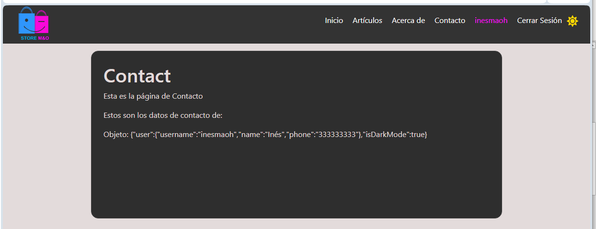

# React + Vite

Este proyecto es un ejercicio para practicar ContextAPI, desarrollado con React y Vite.
- Sitio web SPA
- Renderizamos varios componentes para construir el sitio
- Configuramos página de error
- Configuramos y aplicamos un módulo CSS en la página de error
- Gestionamos  el estado Global con context API
- Login y Logout a nivel de front
- Consumo de API Pública en Artículos
- Configurar  Dark Mode




## Instalación

Para ejecutar este proyecto en tu máquina local, sigue estos pasos:

1. Clona este repositorio en tu máquina local (Crea un Fork si lo vas a editar):

    ```bash
    git clone https://github.com/inesmariao/boot2_contextAPI.git
    ```

2. Navega al directorio del proyecto:

    ```bash
    cd boot2_contextAPI
    ```

3. Instala las dependencias del proyecto utilizando npm:

    ```bash
    npm install
    ```
## Ejecución del Proyecto

1. Inicia el servidor de desarrollo:

    ```bash
    npm run dev
    ```

2. Abre tu navegador y ve a:

    ```
    http://localhost:5173  (revisa el número de tu puerto en la consola donde iniciaste el servidor de desarrollo)
    ```
---
## Contribuciones

> [!TIP]
> ¡Si te gustó este proyecto, puedes dejarme una estrella en el repositorio! 🌟

Si estás interesado en contribuir al proyecto para hacer mejoras, puedes solicitarme unirte al repositorio como contribuidor, enviándome un correo a inesmaoh@gmail.com.

> [!NOTE]
> Por favor, sigue las guías de contribución y buenas prácticas antes de enviar un Pull Request.

## Licencia

Este proyecto está licenciado bajo la [Licencia ISC](https://opensource.org/licenses/ISC). Consulta el archivo LICENSE para más detalles.

> [!IMPORTANT]
> **Copyright 2024. Ing. Inés María Oliveros**

Por la presente se concede permiso para utilizar, copiar, modificar y/o distribuir este software para cualquier fin, con o sin cargo, siempre que el aviso de copyright anterior y este aviso de permiso aparezcan en todas las copias.

EL SOFTWARE SE PROPORCIONA "TAL CUAL" Y EL AUTOR RECHAZA TODA GARANTÍA CON RESPECTO A ESTE SOFTWARE, INCLUIDAS TODAS LAS GARANTÍAS IMPLÍCITAS DE COMERCIABILIDAD E IDONEIDAD. EN NINGÚN CASO EL AUTOR SERÁ RESPONSABLE DE NINGÚN DAÑO ESPECIAL, DIRECTO, INDIRECTO O CONSECUENTE, NI DE NINGÚN DAÑO DERIVADO DE LA PÉRDIDA DE USO, DATOS O BENEFICIOS, YA SEA EN UNA ACCIÓN CONTRACTUAL, NEGLIGENCIA U OTRA ACCIÓN ILÍCITA, QUE SURJA DE O EN RELACIÓN CON EL USO O RENDIMIENTO DE ESTE SOFTWARE.

## License

> [!IMPORTANT]
> **Copyright 2024. Ing. Inés María Oliveros Hernández**

Permission to use, copy, modify, and/or distribute this software for any purpose with or without fee is hereby granted, provided that the above copyright notice and this permission notice appear in all copies.

THE SOFTWARE IS PROVIDED “AS IS” AND THE AUTHOR DISCLAIMS ALL WARRANTIES WITH REGARD TO THIS SOFTWARE INCLUDING ALL IMPLIED WARRANTIES OF MERCHANTABILITY AND FITNESS. IN NO EVENT SHALL THE AUTHOR BE LIABLE FOR ANY SPECIAL, DIRECT, INDIRECT, OR CONSEQUENTIAL DAMAGES OR ANY DAMAGES WHATSOEVER RESULTING FROM LOSS OF USE, DATA OR PROFITS, WHETHER IN AN ACTION OF CONTRACT, NEGLIGENCE OR OTHER TORTIOUS ACTION, ARISING OUT OF OR IN CONNECTION WITH THE USE OR PERFORMANCE OF THIS SOFTWARE.
